Machine Learning and Pattern Recognition - Exercise <br>
Mikael Kylänpää <br>
4/4/2019


# Image recognition of color images

## Introduction
The task of this exercise is to acquire a set of images, extract features from
them, and train a set of classifiers to predict the contents of the images.

## Data set
<b>These image URLs are provided by <a href=http://www.image-net.org>ImageNet</a> for educational and non-commercial use only. I do not own these images.</b>

Using a premade set of image URLs located in text files:
* birdnests.txt: 39 birdnest images
* honeycomb.txt: 39 honeycomb images
* lighthouses.txt: 42 lighthouse images

There can be faulty URLs, so the image counts may vary. The images are colorful
and come in varying sizes.

## Methods
Using the predefined set of methods:
* preparation: resize, grayscale
* feature extraction: RGB means & variances, grayscale level co-occurrence matrix, zscore
* visualization: principal component analysis, self-organizing map
* classifiers: k nearest neighbors, Ridge regression, multilayer perceptron (neural network)
* evaluation:  cross-validation, nested cross-validation, early stopping, accuracy-score, confusion matrix

## Data preparation
The images are downloaded as they are. No images are excluded from the set apart
from those that fail to load.

---

# 1. Data import
Download images and assign integers as class-labels:
* birdnests: 0
* honeycombs: 1
* lighthouses: 2  


```python
import numpy as np
from skimage import io

imgs = [] # raw images
labels = []

print("\nDownloading images")

for url in np.loadtxt('images/birdnests.txt', dtype='U100'): # birdnests
    try:
        imgs.append(io.imread(url)) # add label after succesful entry
        labels.append(0)
    except:
        continue # skip faulty URL
print("set downloaded")

for url in np.loadtxt('images/honeycomb.txt', dtype='U100'): # honeycombs
    try:
        imgs.append(io.imread(url))
        labels.append(1)
    except:
        continue
print("set downloaded")

for url in np.loadtxt('images/lighthouse.txt', dtype='U100'): # lighthouses
    try:
        imgs.append(io.imread(url))
        labels.append(2)
    except:
        continue
print("set downloaded")

imgs = np.array(imgs) # convert to numpy array for later usability
labels = np.array(labels)

# Retrieve class indices:

inds1 = []
inds2 = []
inds3 = []

for i in range(len(labels)):
    if labels[i] == 0: # birdnests
        inds1.append(i)
    if labels[i] == 1: # honeycombs
        inds2.append(i)
    if labels[i] == 2: # lighthouses
        inds3.append(i)
```

    
    Downloading images
    set downloaded
    set downloaded
    set downloaded
    

# 2. Data preparation
In order to compare images pixel by pixel, they need to be in the same size. Find
the mode width and height of all images, and resize them correspondingly.

Save also grayscale versions of images. The quantization level must be reduced
to 8 bits for GLCM.


```python
import matplotlib.pyplot as plt
from skimage.transform import resize
from skimage.color import rgb2gray
from skimage import img_as_ubyte

# Calculate sizes:

ws = []
hs = []

for img in imgs:
    ws.append(len(img))
    hs.append(len(img[0]))

# Resize images to mode:

for i in range(len(imgs)):
    imgs[i] = resize(imgs[i], (np.bincount(ws).argmax(), np.bincount(hs).argmax()))

# Verify changes by showing some images:

fig, ax = plt.subplots(1,4, figsize=(15,5))
ax[0].imshow(imgs[0])
ax[1].imshow(imgs[1])
ax[2].imshow(imgs[inds2[0]])
ax[3].imshow(imgs[inds3[0]])
plt.show()

# Convert to grayscale:

imgs_gr = []

for i in range(len(imgs)):
    imgs_gr.append(rgb2gray(imgs[i]))
    imgs_gr[i] = img_as_ubyte(imgs_gr[i]) # reduce quantization (8-bit u-int)
    

plt.imshow(imgs_gr[10], cmap='Greys_r')
plt.show()
```


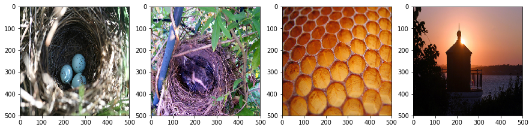


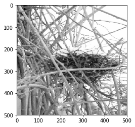


# 3. Feature extraction
From color images, extract the RGB means and variances per horizontal pixel (vertically).
This sums up to 500 (image height) x 3 (color channels) x 2 (mean & variance)
= 3000 features per image.

Extract grayscale level co-occurrence features from grayscale images. This is usually
done by selecting different patches from different parts of the image. In this
case, let's select 3 different sized patches from the center of the image, assuming
that the main element is in the center. A GLC-matrix is contructed from the patch,
in this case by 4 different angles. From every GLCM, 5 different values are extracted.
This makes 3 (patches) x 4 (angles) x 5 (values) = 60 features per grayscale image.

The two feature sets are first standardized individually by zscore. This scales
all feature columns into same limit for each set.


```python
from skimage.feature import greycomatrix, greycoprops
from scipy.stats import zscore

# Extract RGB features:

feats_rgb = [] # feature array

print("\nExtracting RGB")

for img in imgs:
    r = img[:,:,0] # r, g & b -matrices
    g = img[:,:,1]
    b = img[:,:,2]
    r_mean = np.mean(r, axis=1) # calculate means & variances per horizontal pixel vector
    g_mean = np.mean(g, axis=1)
    b_mean = np.mean(b, axis=1)
    r_var = np.var(r, axis=1)
    g_var = np.var(g, axis=1)
    b_var = np.var(b, axis=1)
    
    feat_vect = [] # add values into feature vector
    for i in range(len(r_mean)):
        feat_vect.append(r_mean[i])
        feat_vect.append(g_mean[i])
        feat_vect.append(b_mean[i])
        feat_vect.append(r_var[i])
        feat_vect.append(g_var[i])
        feat_vect.append(b_var[i])
    
    feats_rgb.append(feat_vect) # add vector to feature array

feats_rgb = np.array(feats_rgb)
print(feats_rgb.shape)

# Extract GLCM features:

feats_gr = []

print("\nExtracting GLCM")

for img in imgs_gr:
    patches = [] # select patches from center
    patches.append(img[225:275, 225:275]) # 50x50
    patches.append(img[200:300, 200:300]) # 100x100
    patches.append(img[125:375, 125:375]) # 200x200
    
    feat_vect = []
    for patch in patches:
        glcm = greycomatrix(patch, distances=[5], # compute GLCM matrix
                            angles=[0, np.pi/4, np.pi/2, 3*np.pi/4], # angle radians
                            levels=256, # 256 for an 8-bit image
                            symmetric=True, normed=True)
        feat_vect.extend(greycoprops(glcm, 'contrast')[0][:]) # compute & add GLCM values
        feat_vect.extend(greycoprops(glcm, 'dissimilarity')[0][:])
        feat_vect.extend(greycoprops(glcm, 'homogeneity')[0][:])
        feat_vect.extend(greycoprops(glcm, 'ASM')[0][:])
        feat_vect.extend(greycoprops(glcm, 'correlation')[0][:])
    
    feats_gr.append(feat_vect)

feats_gr = np.array(feats_gr)
print(feats_gr.shape)

# Zscore standardization:
feats_rgb = zscore(feats_rgb, axis=0)
feats_gr = zscore(feats_gr, axis=0)
```

    
    Extracting RGB
    (119, 3000)
    
    Extracting GLCM
    (119, 60)
    

# 4. Principal component analysis (PCA)
Reduce feature dimensionality to 2 principal components and plot the data. Plot
the feature sets first individually. Produce also combined PCA, by merging the prior
principal components, standardizing them to same scale with zscore and running
another PCA on them.


```python
from sklearn.decomposition import PCA

# PCA:

# separate
pca = PCA(n_components=2)
pca_rgb = pca.fit_transform(feats_rgb)
pca_gr = pca.fit_transform(feats_gr)
# combined
feats_pcas = np.column_stack([pca_rgb, pca_gr]) # merge results
feats_pcas = zscore(feats_pcas, axis=0) # standardize
pca_comb = pca.fit_transform(feats_pcas) # PCA again

# Visualize with scatterplots:

fig, ax = plt.subplots(2,2, figsize=(15,10))

ax[0,0].scatter(pca_rgb[inds1,0], pca_rgb[inds1,1], color='blue') # RGB
ax[0,0].scatter(pca_rgb[inds2,0], pca_rgb[inds2,1], color='red')
ax[0,0].scatter(pca_rgb[inds3,0], pca_rgb[inds3,1], color='green')
ax[0,0].set_title('PCA on RGB-features only')
ax[0,0].set_xlabel('PC1')
ax[0,0].set_ylabel('PC2')
ax[0,0].legend(['birdnests','honeycombs','lighthouses'])

ax[0,1].scatter(pca_gr[inds1,0], pca_gr[inds1,1], color='blue') # GLCM
ax[0,1].scatter(pca_gr[inds2,0], pca_gr[inds2,1], color='red')
ax[0,1].scatter(pca_gr[inds3,0], pca_gr[inds3,1], color='green')
ax[0,1].set_title('PCA on GLCM-features only')
ax[0,1].set_xlabel('PC1')
ax[0,1].set_ylabel('PC2')
ax[0,1].legend(['birdnests','honeycombs','lighthouses'])

ax[1,0].scatter(pca_comb[inds1,0], pca_comb[inds1,1], color='blue') # combined
ax[1,0].scatter(pca_comb[inds2,0], pca_comb[inds2,1], color='red')
ax[1,0].scatter(pca_comb[inds3,0], pca_comb[inds3,1], color='green')
ax[1,0].set_title('PCA on combined feature sets')
ax[1,0].set_xlabel('PC1')
ax[1,0].set_ylabel('PC2')
ax[1,0].legend(['birdnests','honeycombs','lighthouses'])

ax[1,1].axis('off')

plt.show()
```


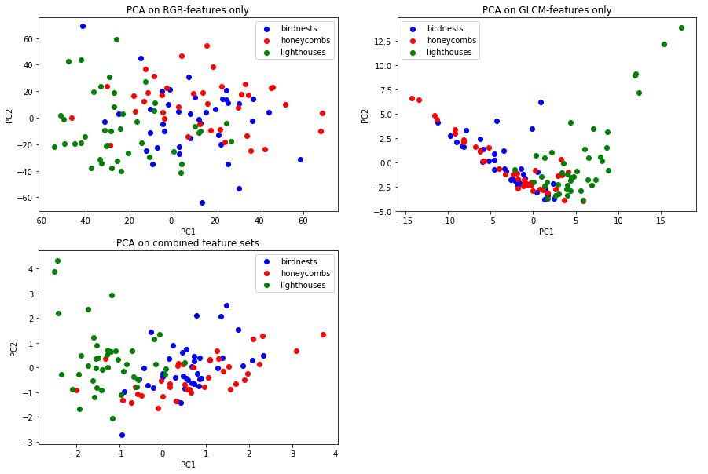


PCA on pure RGB-features didn't seem to reveal much difference between the classes. However, the GLCM-featureset clearly separated lighthouses from the other 2 classes. This might be due to the clear sky that is in the background for most of the lighthouse images. Let's see how this affects the classifiers.

---

# 5. Self-organizing maps (SOM)
Visualize features with self-organizing maps. Similar to PCA, SOM enables the strucure
of the data to be visualized in 2D. Let's visualize both the RGB and GLCM feature
sets individually.

Using MiniSom library (https://github.com/JustGlowing/minisom)
*"if your dataset has 150 samples, 5xsqrt(150) = 61.23 --- hence a map 8-by-8 should perform well."*

* Using 8x7 (=56) grid with this data.


```python
from minisom import MiniSom

# Train RGB SOM:

print("\nTraining SOM")

som = MiniSom(8, 7, len(feats_rgb[0]))
som.train_random(feats_rgb,
                 20000, # iterations amount
                 verbose=False)

plt.figure(figsize=(8,7)) # draw nodes, background coloring
plt.pcolor(som.distance_map().T, cmap='Greys_r')
plt.colorbar()

for i in range(len(feats_rgb)): # plot images
    if i in inds1: # birdnests
        colr = 'blue'
        pos = 0.3
    if i in inds2: # honeycombs
        colr = 'red'
        pos = 0.5
    if i in inds3: # lighthouses
        colr = 'green'
        pos = 0.7
    w = som.winner(feats_rgb[i]) # draw dot into winner node/tile
    plt.plot(w[0]+pos, w[1]+.5, 'o', markerfacecolor=colr, markersize=15, markeredgewidth=0)

plt.title('RGB SOM, 20000 random samples')
plt.axis([0, 8, 0, 7])
plt.show()
```

    
    Training SOM
    


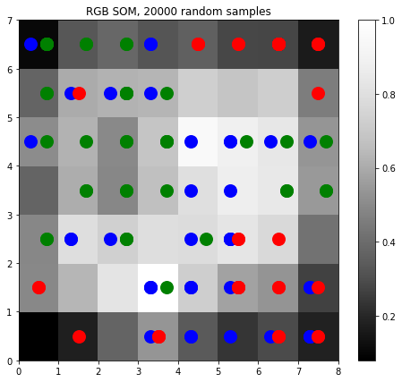


*Birdnests=blue, honeycombs=red, lighthouses=green. The white areas in the image represent dense areas where many samples fall into.*

This SOM seems to find better separation between classes than PCA, even based only on the RGB features. These maps tend to vary a lot though, and another set of random weights could show less separation. Applying more iterations/random samples didn't affect the result much.


```python
# Train GLCM SOM:

print("\nTraining SOM")

som = MiniSom(8, 7, len(feats_gr[0]))
som.train_random(feats_gr, 50000, verbose=False)
plt.figure(figsize=(8,7))
plt.pcolor(som.distance_map().T, cmap='Greys_r')

for i in range(len(feats_gr)):
    if i in inds1:
        colr = 'blue'
        pos = 0.3
    if i in inds2:
        colr = 'red'
        pos = 0.5
    if i in inds3:
        colr = 'green'
        pos = 0.7
    w = som.winner(feats_gr[i])
    plt.plot(w[0]+pos, w[1]+.5, 'o', markerfacecolor=colr,
             markersize=15, markeredgewidth=0)

plt.title('GLCM SOM, 50000 random samples')
plt.axis([0, 8, 0, 7])
plt.show()
```

    
    Training SOM
    


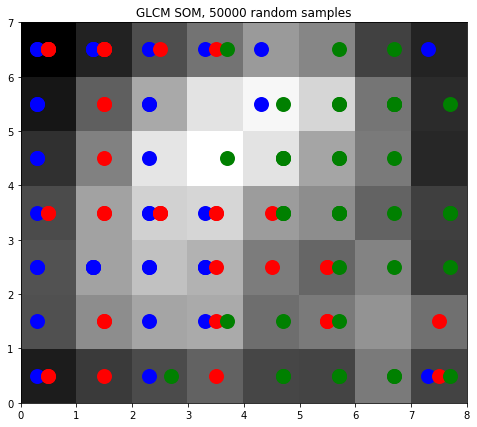


With only GLCM features, the map separates lighthouses (=green) very well, but fails to find much difference between birdnests and honeycombs. The result is very similar to PCA of GLCM-features.

---

# 6. K nearest neighbors classifier (kNN)
kNN doesn't function with high dimensional data. Therefore, reducing dimensions
with PCA. Reducing RGB-features to 10 PCs and GLCM-features to 5 PCs.

Using nested cross-validation to optimize k and validate performance:
* outer loop (validation): Stratified 10-fold CV. Generates 10 stratified folds
  from the data. Uses one fold at a time as the test set, and the rest of the inputs as the
  model selection set. Stratification means that every fold has similar ratio of labels (for example: 20 birdnests, 20 honeycombs & 25 lighthouses on every fold).
* inner loop (model selection): Iterates through the candidates for best k. Trains
  the classifier in leave-one-out CV (one input as the test set, the rest as
  the training set /iteration). Calculates full set predictions for every k in order to find the best one.

For each outer loop fold-set, the best k is selected by accuracy-%. The best classifier
is then trained again to predict the validation set to simulate predicting unseen
data.


```python
import random
from sklearn.neighbors import KNeighborsClassifier
from sklearn.model_selection import StratifiedKFold
from sklearn.metrics import accuracy_score
from sklearn.metrics import confusion_matrix

# Reduce dimensionality with PCA:

pca = PCA(n_components=10) # 10 for RGB
pca_rgb = pca.fit_transform(feats_rgb)
pca = PCA(n_components=5) # 5 for GLCM
pca_gr = pca.fit_transform(feats_gr)
feats_knn = np.column_stack([pca_rgb, pca_gr]) # merge features
feats_knn = zscore(feats_knn, axis=0) # standardize again

# Nested CV:

ks = range(1, 26) # k candidates (1,2,...,25)
ks_best = [] # winner ks
acc_train = [] # winner k training accuracies
acc_valid = [] # winner k validation accuracies
preds_knn = [] # final predictions
kf = StratifiedKFold(n_splits=10) # 10 folds
inds_kf = [] # stratification-ordered indices & labels
labels_kf = []

print("\nRunning kNN CV")

for inds_model, inds_valid in kf.split(feats_knn, labels): # outer loop
    X_model = feats_knn[inds_model] # assign model selection & validation sets
    y_model = labels[inds_model]
    X_valid = feats_knn[inds_valid]
    y_valid = labels[inds_valid]
    inds_kf.extend(inds_valid) # save index & label
    labels_kf.extend(y_valid)
    
    acc_ks = [] # accuracies of different ks
    for k in ks:
        y_pred = [] # loo predictions
        
        for i in range(len(X_model)): # inner loop
            X_test = [X_model[i]] # assign test & train set
            X_train = np.delete(X_model, i, axis=0)
            y_train = np.delete(y_model, i)
            knn = KNeighborsClassifier(n_neighbors=k) # train classifier
            knn.fit(X_train, y_train)
            y_pred.append(knn.predict(X_test)) # predict test & save result
        
        acc_ks.append(accuracy_score(y_model, y_pred)) # calculate & save training accuracy for k
    
    ind_best = np.argmax(acc_ks) # find best k
    k_best = ks[ind_best]
    ks_best.append(k_best)
    acc_train.append(acc_ks[ind_best]) # save training accuracy of best k
    knn = KNeighborsClassifier(n_neighbors=k_best) # train whole fold-set with best k
    knn.fit(X_model, y_model)
    preds = knn.predict(X_valid) # predict validation set
    preds_knn.extend(preds) # save predictions
    acc_valid.append(accuracy_score(y_valid, preds)) # save validation accuracy
    #print("fold-set complete")

# Evaluation:

cv_result = np.column_stack([ks_best, acc_train, acc_valid])
print("\nbest k, acc-train, acc-valid")
print(np.round(cv_result,3))
print("\nOverall accuracy-% (validation): " + str(accuracy_score(labels_kf, preds_knn))
      + "\n\nConfusion matrix:\nbn-preds, hc-preds, lh-preds")
print(confusion_matrix(labels_kf, preds_knn))
```

    
    Running kNN CV
    
    best k, acc-train, acc-valid
    [[ 6.     0.764  0.692]
     [10.     0.755  0.846]
     [ 6.     0.804  0.583]
     [ 9.     0.785  0.917]
     [ 3.     0.757  0.417]
     [ 9.     0.776  0.75 ]
     [ 7.     0.766  0.833]
     [ 6.     0.757  0.833]
     [10.     0.796  0.727]
     [ 6.     0.789  0.8  ]]
    
    Overall accuracy-% (validation): 0.7394957983193278
    
    Confusion matrix:
    bn-preds, hc-preds, lh-preds
    [[28  9  2]
     [ 8 29  1]
     [11  0 31]]
    

For some reason the k value of 6 predicted best most frequently among the training cross-validations. However, 6's validation accuracy varied a lot. The generalization performance wouldn't probably differ much if any of the best training ks were to be selected as the final k-hyperparameter of the model.

As expected after the PCA and SOM visualization, the most correctly predicted class was the lighthouses. The most frequent error was lighthouses predicted as birdnests. Interestingly, none of the lighthouses were classified as honeycombs.


```python
# Examples:

# plots randomly 4 correct & 4 false classified images for every class
def explot(inds, preds, labels, lab):
    corr = []
    false = []
    for i in range(len(labels)):
        if (labels[i] == lab and preds[i] == lab): # true positives
            corr.append(inds[i])
        elif (labels[i] != lab and preds[i] == lab): # false positives
            false.append(inds[i])
    # random select max 4 inds
    corr = random.sample(corr, min([len(corr), 4]))
    false = random.sample(false, min([len(false), 4]))
    # plot
    fig, ax = plt.subplots(2, 4, figsize=(14,7), sharex=True, sharey=True)
    if lab == 0:
        fig.suptitle('Classified as birdnests:')
    elif lab == 1:
        fig.suptitle('Classified as honeycombs:')
    else:
        fig.suptitle('Classified as lighthouses:')
    # correct
    for i in range(4):
        if i in range(len(corr)):
            ax[0,i].imshow(imgs[corr[i]])
            ax[0,i].set_title(corr[i])
        else:
            ax[0,i].axis('off') # if under 4 corr found
    # false
    for i in range(4):
        if i in range(len(false)):
            ax[1,i].imshow(imgs[false[i]])
            ax[1,i].set_title(false[i])
        else:
            ax[0,i].axis('off') # if under 4 false found
    [ax.set_axis_off() for ax in ax.ravel()]
    plt.show()

explot(inds_kf, preds_knn, labels_kf, 0) # birdnests
explot(inds_kf, preds_knn, labels_kf, 1) # honeycombs
explot(inds_kf, preds_knn, labels_kf, 2) # lighthouses
```


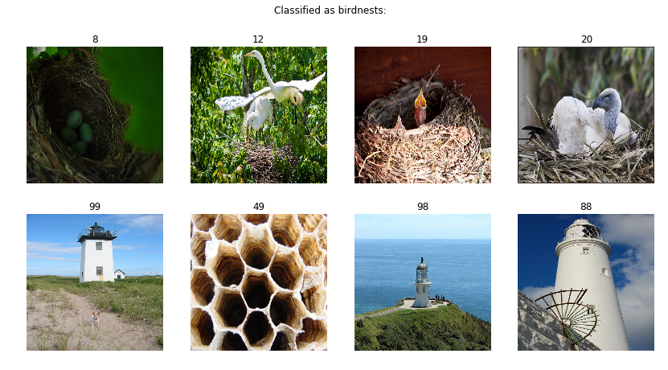


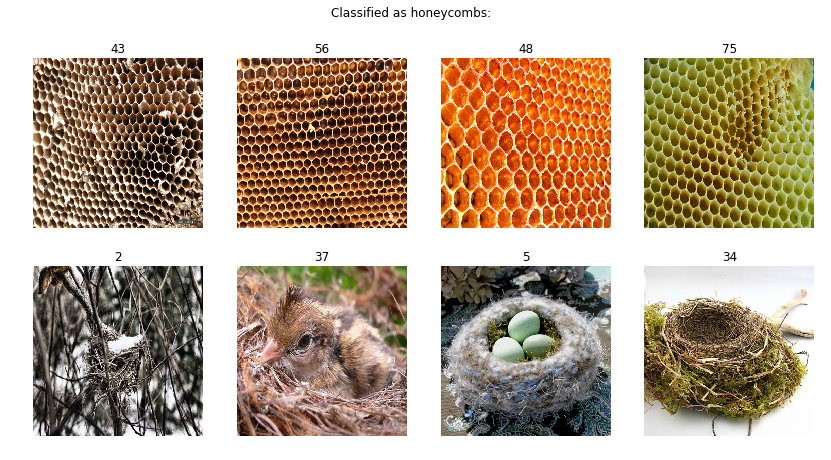


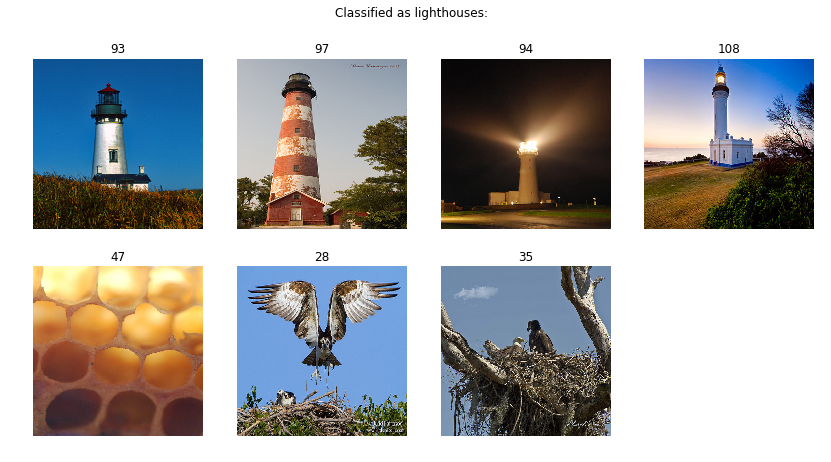


---
# 7. Ridge regression classifier
Ridge regression (reguralized linear model) is similar to least squares, but it
uses bias to reduce errors on multicollinear data. Ridge regression functions with
high dimensional data, so using the full feature set.

Using the same nested CV than with kNN to optimize alpha and predict on validation
set. The stratification splits are also same.


```python
from sklearn.linear_model import RidgeClassifier

# Full feature set with standardization:

feats_all = np.column_stack([feats_rgb, feats_gr])
feats_all = zscore(feats_all, axis=0)

# Nested CV:

alphas = [0.01, 0.1, 1, 10, 100, 500, 1000, 2000, 5000]
as_best = [] # winner alphas
acc_train = []
acc_valid = []
preds_ridge = []

kf = StratifiedKFold(n_splits=10) # will generate same folds than kNN, will use same inds_kf & labels_kf

print("\nRunning Ridge CV")

for inds_model, inds_valid in kf.split(feats_all, labels):
    X_model = feats_all[inds_model]
    y_model = labels[inds_model]
    X_valid = feats_all[inds_valid]
    y_valid = labels[inds_valid]
    acc_as = [] # accuracies of different alphas
    for a in alphas:
        y_pred = []
        for i in range(len(X_model)):
            X_test = [X_model[i]]
            X_train = np.delete(X_model, i, axis=0)
            y_train = np.delete(y_model, i)
            ridge = RidgeClassifier(alpha=a) # train classifier
            ridge.fit(X_train, y_train)
            y_pred.append(ridge.predict(X_test))
        acc_as.append(accuracy_score(y_model, y_pred))
    ind_best = np.argmax(acc_as) # find best alpha
    a_best = alphas[ind_best]
    as_best.append(a_best)
    acc_train.append(acc_as[ind_best]) # save training accuracy of best alpha
    ridge = RidgeClassifier(alpha=a_best)
    ridge.fit(X_model, y_model)
    preds = ridge.predict(X_valid) # predict validation set
    preds_ridge.extend(preds)
    acc_valid.append(accuracy_score(y_valid, preds))
    #print("fold-set complete")

# Evaluation:

cv_result = np.column_stack([as_best, acc_train, acc_valid])
print("\nbest a, acc-train, acc-valid")
np.set_printoptions(suppress=True)
print(np.round(cv_result,3))
print("\nOverall accuracy-% (validation): " + str(accuracy_score(labels_kf, preds_ridge))
      + "\n\nConfusion matrix:\nbn-preds, hc-preds, lh-preds")
print(confusion_matrix(labels_kf, preds_ridge))
```

    
    Running Ridge CV
    
    best a, acc-train, acc-valid
    [[1000.       0.736    0.846]
     [ 500.       0.736    0.615]
     [5000.       0.72     0.75 ]
     [5000.       0.738    0.75 ]
     [1000.       0.776    0.667]
     [2000.       0.729    0.667]
     [5000.       0.72     0.667]
     [1000.       0.748    0.833]
     [2000.       0.769    0.636]
     [ 500.       0.716    0.9  ]]
    
    Overall accuracy-% (validation): 0.7310924369747899
    
    Confusion matrix:
    bn-preds, hc-preds, lh-preds
    [[21 11  7]
     [ 8 29  1]
     [ 3  2 37]]
    

The optimized alpha value was surprisingly high on each fold-set. This is probably due to high dimensionality of the data. Once again, the validation accuracy was very fold-dependent and varied a lot. The overall validation accuracy was practically the same as with kNN.

This classifier found much more honeycombs and lighthouses than kNN. Lighthouses were again the most correct class. The most common error was this time birdnests predicted as honeycombs.


```python
explot(inds_kf, preds_ridge, labels_kf, 0)
explot(inds_kf, preds_ridge, labels_kf, 1)
explot(inds_kf, preds_ridge, labels_kf, 2)
```


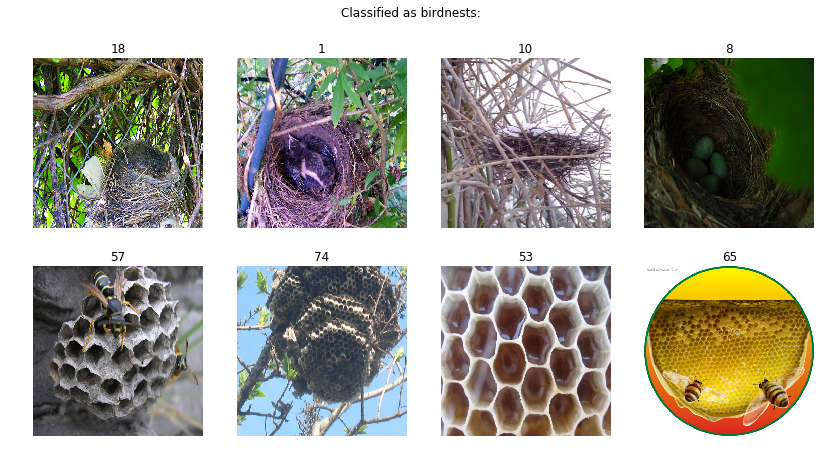


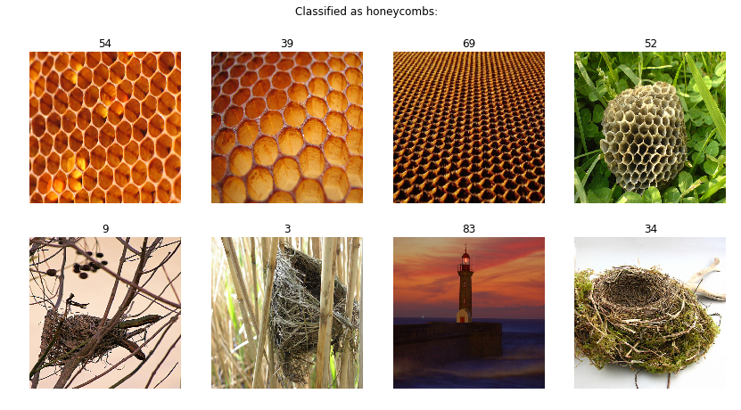


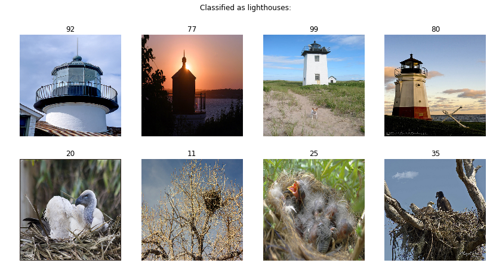


---
# 8. Multilayer perceptron committee/ensemble classifier
## Model structure
Using TensorFlow and Keras to build multilayer perceptrons, which are simple artificial
neural networks (ANNs). Instead of a single network, using an ensemble (or committee).
This means training a set of multiple models and generalizing their outputs for
the final output.

In this case, using an ensemble of 5 members. The training inputs are split to 5
folds, and each model is fitted to one fold. A separate validation set is then
used to validate the generalization performance. The final prediction of the ensemble
is the maximum class among separate models' predictions.

Each member is a similar feed-forward multilayer perceptron (MLP) with 1 hidden
layer of 256 neurons (3060 inputs => 256 hidden layer neurons => 3 outputs).

## Training & validation setup

Using stratified 10-fold CV in order to make validation predictions on the whole
input set. The stratification splits are again the same.

The models are re-trained multiple times, but each time the training is 'early
stopped' at the same state. (TODO: define)
Therefore, the performance on each validation fold should be similar.


```python
import tensorflow as tf

np.random.seed(0) # set seed reproduce calculations
tf.set_random_seed(0)

# 10-fold CV:

n_members = 5 # ensemble members
n_neurons = 256 # hidden layer neurons
n_epochs = 100 # training epochs/model
acc_valid = []
preds_mlp = []
kf = StratifiedKFold(n_splits=10)

print("\nRunning MLP CV")

for inds_train, inds_valid in kf.split(feats_all, labels):
    # using full feature set, split data to model & validation sets
    X_train = feats_all[inds_model]
    y_train = labels[inds_model]
    X_valid = feats_all[inds_valid]
    y_valid = labels[inds_valid]
    # split training set to folds, shuffle for stratification
    Xy = np.column_stack([X_train, y_train]) # merge X & y
    np.random.shuffle(Xy) # shuffle
    X_train = Xy[:, :-1] # split X
    y_train = Xy[:, -1] # split y
    y_train_enc = tf.keras.utils.to_categorical(y_train, num_classes=3) # Keras requires categorical outputs
    X_folds = np.array_split(X_train, n_members)
    y_folds = np.array_split(y_train_enc, n_members)
    
    # train ensemble
    preds_memb = [] # indiviual model predictions
    for i in range(n_members):
        
        # build the model
        model = tf.keras.Sequential() # basic feed-forward
        model.add(tf.keras.layers.Dense( # every neuron connected
                n_neurons, # hidden layer neurons
                input_dim=3060, # input layer neurons
                activation='relu')) # hidden layer activation
        model.add(tf.layers.Dense(
                3, # output layer neurons
                activation='softmax')) # categorical, multi-class
        
        # use custom learning rate, otherwise overfitting after 1st epoch
        model.compile(
                optimizer=tf.keras.optimizers.Adam(lr=0.00001),
                loss='categorical_crossentropy', # categorical
                metrics=['accuracy']) # score metrics
        
        X_test = [] # use other folds as test set
        y_test = []
        for j in range(n_members):
            if j != i:
                X_test.extend(X_folds[j])
                y_test.extend(y_folds[j])
        X_test = np.array(X_test)
        y_test = np.array(y_test)
        
        # train model with early stop
        model.fit(X_folds[i], y_folds[i], epochs=n_epochs, verbose=0,
                  validation_data=(X_test, y_test),
                  
                  # define early stopping policy
                  callbacks=[tf.keras.callbacks.EarlyStopping(
                          monitor='val_acc', # optimize validation accuracy
                          patience=25, # number of epochs to wait for better
                          verbose=0,
                          mode='max', # maximize accuracy
                          restore_best_weights=True)]) # restore optimum after wait
        
        preds_memb.append(model.predict_classes(X_valid)) # predict validation set
    
    # generalize
    preds_memb = np.array(preds_memb).T
    preds_fold = [] # generalized fold predictions
    for row in preds_memb:
        preds_fold.append(np.bincount(row).argmax())
    
    # save ensemble predictions
    acc_valid.append(accuracy_score(y_valid, preds_fold))
    preds_mlp.extend(preds_fold)
    tf.keras.backend.clear_session() # clear GPU memory after ensemble
    #print("fold-set complete")

# Evaluation:

print("\nacc-% (valid) per ensemble:")
print(np.round(acc_valid, 3))
print("\nOverall accuracy-% (validation): " + str(accuracy_score(labels_kf, preds_mlp))
      + "\n\nConfusion matrix:\nbn-preds, hc-preds, lh-preds")
print(confusion_matrix(labels_kf, preds_mlp))
```

    
    Running MLP CV
    
    acc-% (valid) per ensemble:
    [0.846 1.    0.75  0.833 0.917 0.833 0.75  0.917 0.909 0.7  ]
    
    Overall accuracy-% (validation): 0.8487394957983193
    
    Confusion matrix:
    bn-preds, hc-preds, lh-preds
    [[33  1  5]
     [ 6 32  0]
     [ 6  0 36]]
    

The MLP ensemble/committee performance varies a bit by random, but generally the validation accuracy is around 80% which is almost 10 %-units higher than kNN and Ridge classifiers. This time the accuracy was very high.

In this case, it was interesting that only one honeycomb prediction was wrong, and none of the honeycombs were predicted as lighthouses. Birdnests were clearly the most confusing class for the ensemble.


```python
explot(inds_kf, preds_mlp, labels_kf, 0)
explot(inds_kf, preds_mlp, labels_kf, 1)
explot(inds_kf, preds_mlp, labels_kf, 2)
```


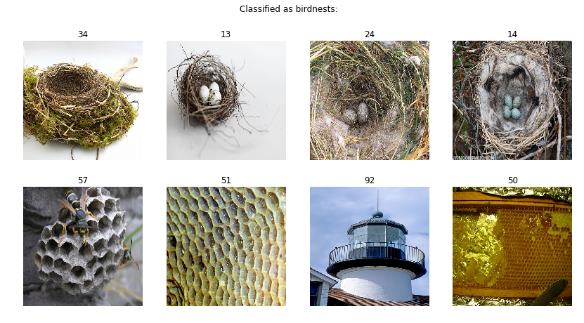


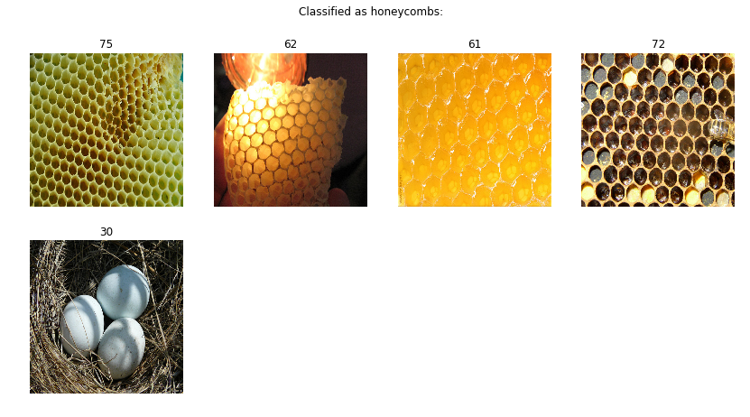


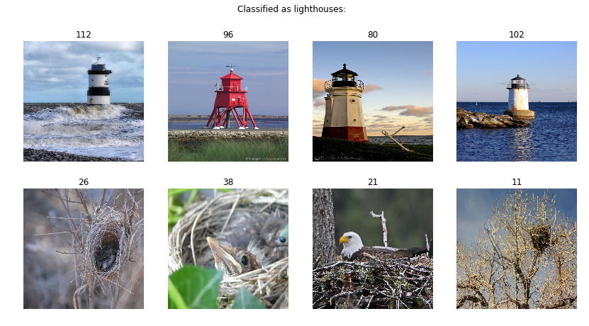


---
# Results and discussion
### Analysis
As mainly statistical computations, the kNN and Ridge classifiers didn't obviously find any patterns in the images. For these, the best predictable images were the lighthouses. The reason could be the clear blue sky behind most of the lighthouse images. However, the most separation with the PCA and SOM visualizations originated from the GLCM images which are in grayscale, so the blue color itself should not be the separating factor, but rather the clarity of the background.

The MLP-implementation performed better, but the misclassifications don't give much reason for it. Many similar looking images were predicted to different classes. It could be that the models have learned some primitive patterns. For example all example-images above predicted as lighthouses contain an element that is focused, and a background that is somewhat blurry/unfocused.

### Improvements
The kNN and Ridge classifier could be improved by better feature extraction and generation. For example kNN used just the PCA to 10 features as input. Multilayer perceptron is a basic form of neural network. It is already proved that a more complex aNN structure performs very well in computer vision. The next step would be to build a deep convolutional neural network for this task.
